
МИНИСТЕРСТВО НАУКИ И ВЫСШЕГО ОБРАЗОВАНИЯ
РОССИЙСКОЙ ФЕДЕРАЦИИ
ФЕДЕРАЛЬНОЕ ГОСУДАРСТВЕННОЕ БЮДЖЕТНОЕ
ОБРАЗОВАТЕЛЬНОЕ УЧРЕЖДЕНИЕ ВЫСШЕГО ОБРАЗОВАНИЯ
«САХАЛИНСКИЙ ГОСУДАРСТВЕННЫЙ УНИВЕРСИТЕТ»

 

Институт естественных наук и техносферной безопасности

Кафедра информатики

Пашаян Самвел Алексанович

 

Лабораторная работа №7

01.03.02 Прикладная математика и информатика

 

Научный руководитель

Соболев Евгений Игоревич

Южно-Сахалинск

2022 г.

<b>ВВЕДЕНИЕ</b>

 <b> PHP  </b> (рекурсивный акроним словосочетания PHP: Hypertext Preprocessor) - это распространённый язык программирования общего назначения с открытым исходным кодом.

 Вместо рутинного вывода HTML-кода командами языка (как это происходит, например, в Perl или C), скрипт PHP содержит HTML с встроенным кодом (в нашем случае, это вывод текста "Привет, я - скрипт PHP!"). Код PHP отделяется специальными начальным и конечным тегами <?php и ?>, которые позволяют "переключаться" в "PHP-режим" и выходить из него.
Код PHP отделяется специальными начальным и конечным тегами <?php и ?>, которые позволяют "переключаться" в "PHP-режим" и выходить из него.

 РЕШЕНИЕ ЗАДАЧ (ОСНОВНАЯ ЧАСТЬ) 

## Решение:
<?php 

function zad1(){
    $var='Hello';
    echo $var[0],$var[1],$var[4];
}

function zad2(){
    echo 1*60*60;
}

function zad3(){
    $var=1;
    $var+=12;
    $var-=14;
    $var*=5;
    $var/=7;
    $var++;
    $var--;
    echo $var;
}
function zad4(){
    $a=3;
     echo $a;
 }
 function zad5(){
    $a=10;
    $b=2;
    echo ($a+$b);
    echo "\n";
    echo ($a-$b);
    echo "\n";
    echo $a*$b;
    echo "\n";
    echo $a/$b;
 }
 function zad6(){
    $c=15;
    $d=2;
     $result=$c+$d;
     echo $result;
    
 }
 function zad7(){
    $a=10;
    $b=2;
    $c=5;
    echo $a+$b+$c;
    
 }
 function zad8(){
    $a=17;
    $b=10;
    $c=$a-$b;
    $d=7;
    $result=$c+$d;
    echo $result;
    
 }
 function zad9(){
    $text="Hello World!";
    echo $text;
     
  }
  function zad10(){
    $text="Hello ";
    $text2="World!";
    echo $text.$text2;
     
  }
  function zad11(){
    $name="Nikita";
    echo "Hello, ".$name;  
  }
  function zad12(){
    $age=21;
    echo "Im ".$age." years old";
     
  }
  function zad13(){
    $text="abcde";
    echo $text[0].'  '.$text[2].'  '.$text[4];
     
  }
  function zad14(){ 
    $text="Hello, world! ";
    $text[0]='!';
    echo $text;
}
function zad15(){ 
    $snum="12345";
    $summ=0;
    $n=strlen($snum);
     for ($i = 0; $i < $n; $i++) 
   {
       $summ+=$snum[$i];
       
   }
    echo $summ;
}
function zad16(){ 
    $h=60*60;
    $d=$h*24;
    $m=$d*30;
    echo $h.'  '.$d.'  '.$m.'  ';
}
function zad17(){
  $h=date('H');
$m=date('i');
$s=date('s');
echo $h." : ".$m." : ".$s;
}
function zad18(){
  $n=6;
echo ($n*$n);
}
function zad19(){
  $var = 47;
$var += 7;
$var -=  18;
$var *= 10;
$var /= 20;
echo $var;
}
function zad20(){
  $text = 'Я';
  $text .=' хочу';
  $text .=' знать';
  $text .= ' PHP!';
  echo $text;
}
function zad21(){
  $var = 10;
$var ++;
$var ++;
$var --;
echo $var;
}
function zad22(){
  $var = 10;
$var += 7;
$var ++;
$var --;
$var +=12;
$var *=7;
$var -=15;
echo $var;
}
echo "Задание 1 "."\n";
zad1();
echo "\n"."Задание 2 "."\n";
zad2();
echo "\n"."Задание 3 "."\n";
zad3();
echo "\n"."Задание 4 "."\n";
zad4();
echo "\n"."Задание 5 "."\n";
zad5();
echo "\n"."Задание 6 "."\n";
zad6();
echo "\n"."Задание 7 "."\n";
zad7();
echo "\n"."Задание 8 "."\n";
zad8();
echo "\n"."Задание 9 "."\n";
zad9();
echo "\n"."Задание 10 "."\n";
zad10();
echo "\n"."Задание 11 "."\n";
zad11();
echo "\n"."Задание 12 "."\n";
zad12();
echo "\n"."Задание 13 "."\n";
zad13();
echo "\n"."Задание 14 "."\n";
zad14();
echo "\n"."Задание 15 "."\n";
zad15();
echo "\n"."Задание 16 "."\n";
zad16();
echo "\n"."Задание 17 "."\n";
zad16();
echo "\n"."Задание 18 "."\n";
zad18();
echo "\n"."Задание 19 "."\n";
zad19();
echo "\n"."Задание 20 "."\n";
zad20();
echo "\n"."Задание 21 "."\n";
zad21();
echo "\n"."Задание 22 "."\n";
zad22();
?>
- - -

## Задачи CodeWars:
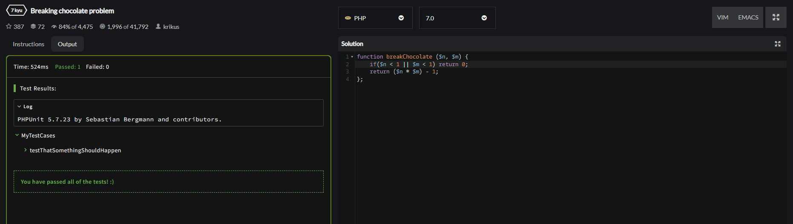
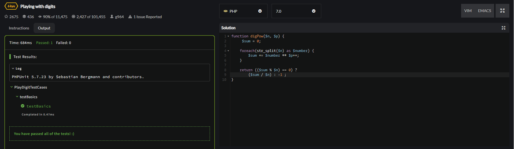
 function.png)
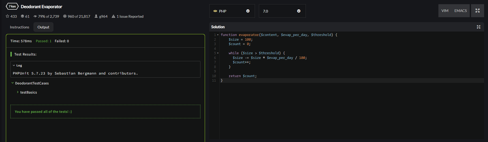
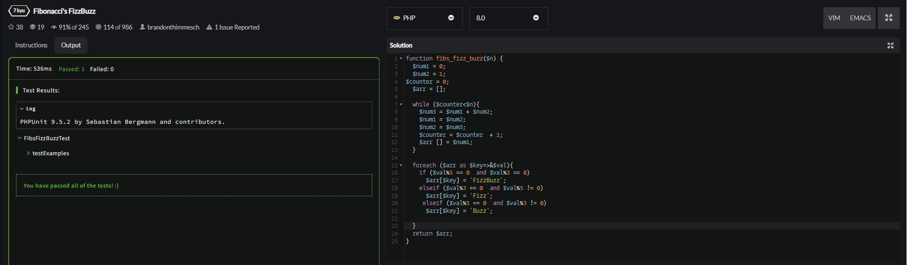
.png)
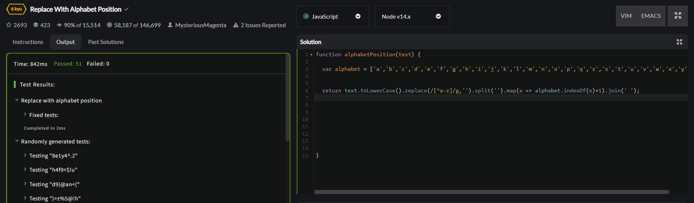
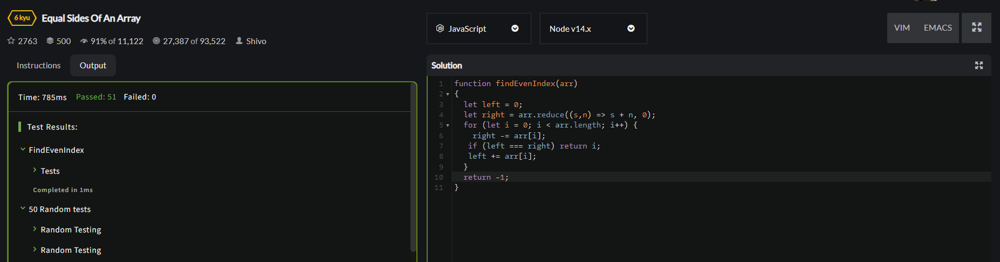
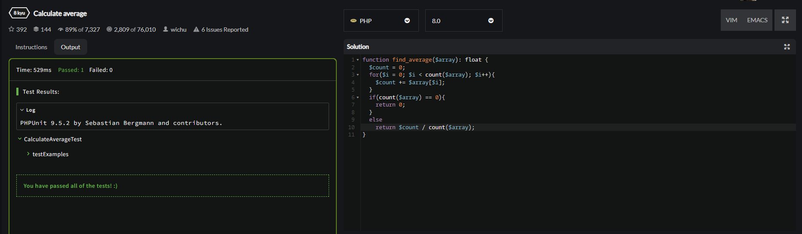
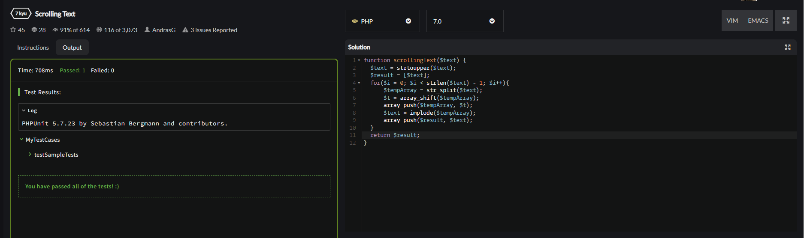
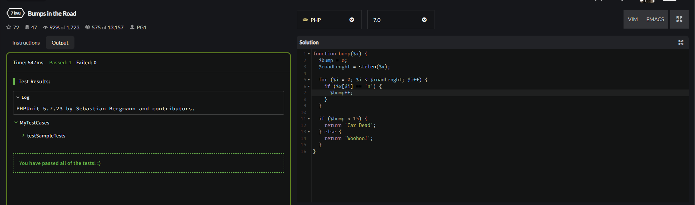
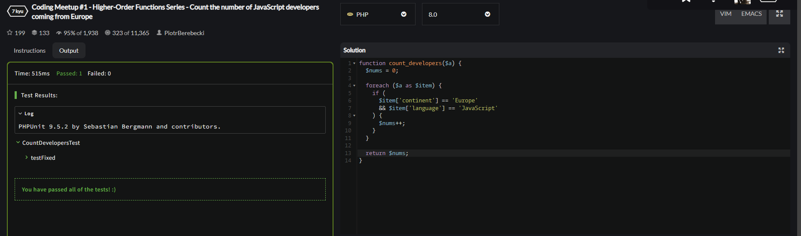
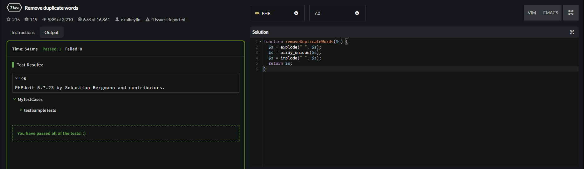

 ВЫВОД 

 Итогом работы стало создание странички с использованием языка PHP. В ходе выполнения задания, мною были решены все выдвинутые задачи, сформулированные исходя из цели лабораторной работы, и в которых нужно было написать функции, выполняющие то или иное действие. Я поработал с различными переменными, выполняющими простейшие операции, где-то нужно было переделать код, а где-то прописать вручную полностью. Это позволяет сделать вывод, что цель данной лабораторной работы успешно достигнута. 

